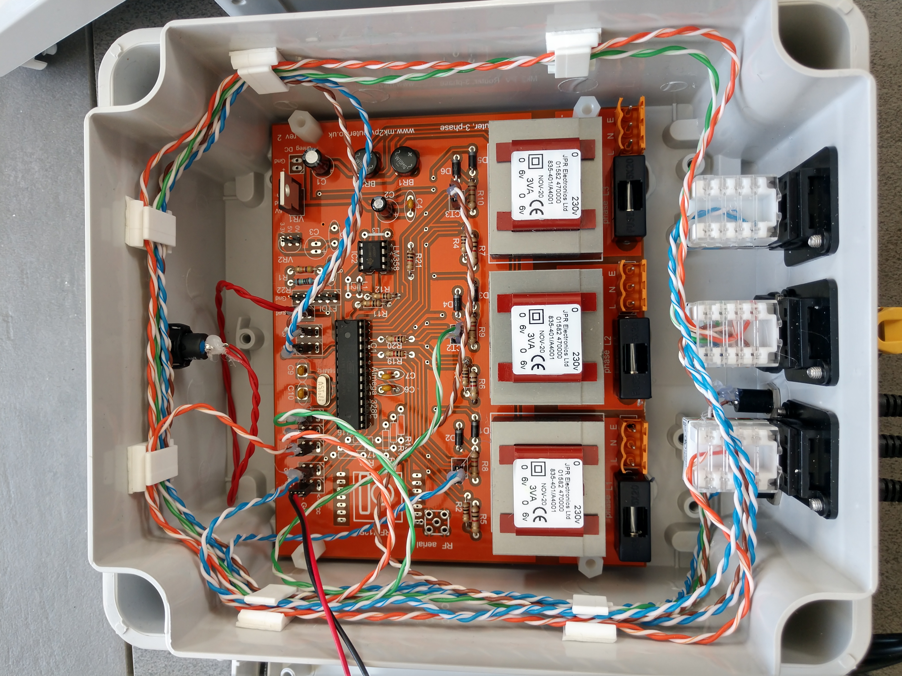
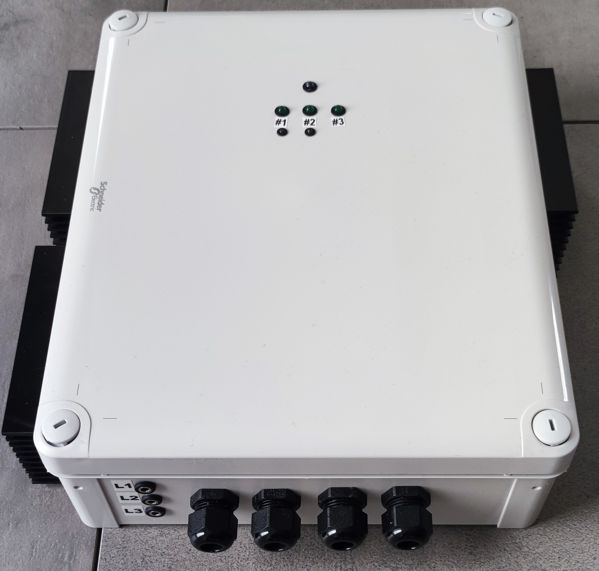

# Photo Gallery (3-phase version)

A couple of my realizations... other coming...

## 3-phase router with 3 outputs

| | |

## 3-phase router with 4 outputs

| | |

## 3-phase router, 4 remote cable-wired outputs (optionally 6), all outputs wired through network-cable, split box

| | | |

## 3-phase router, 3 outputs, 2 of them can be controlled via Internet (ON/OFF and forcing)

| | |

## 3-phase router, 6 outputs, all can be controlled via Internet (forcing and priority inversion)

|
