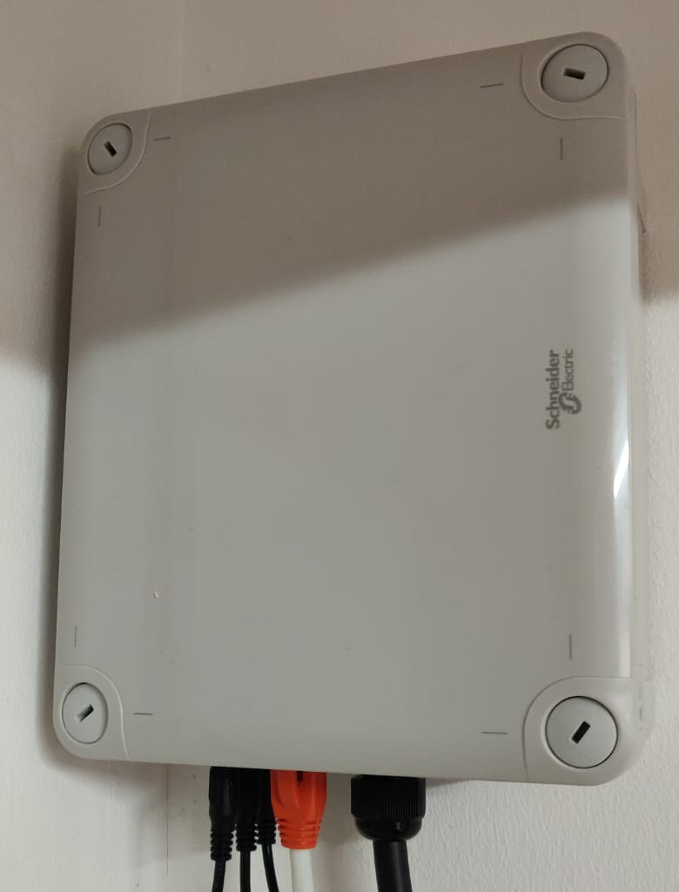
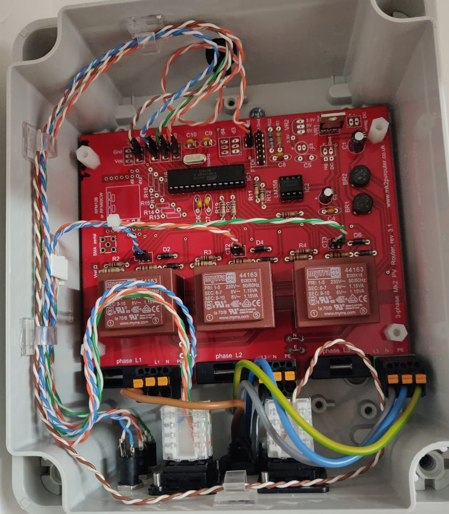
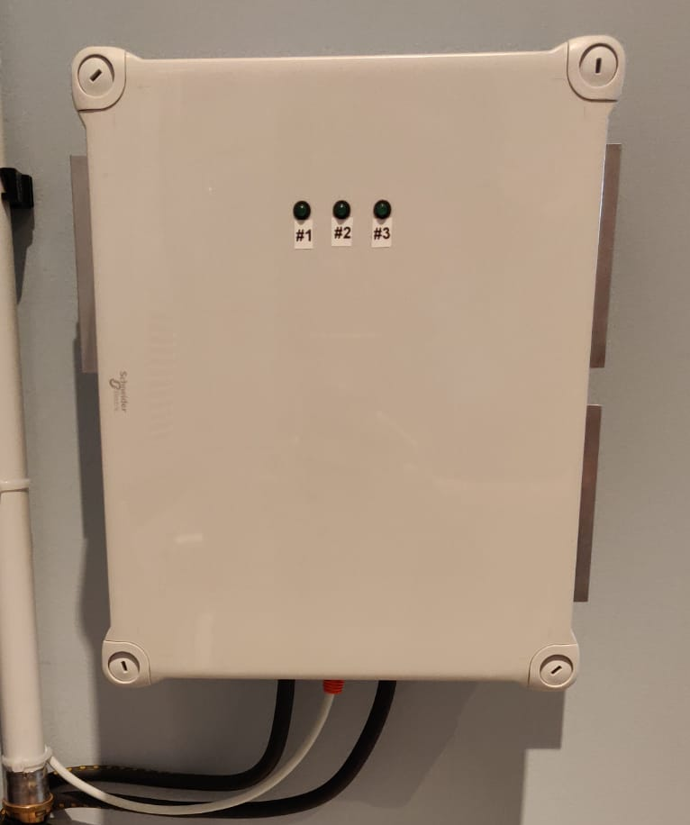
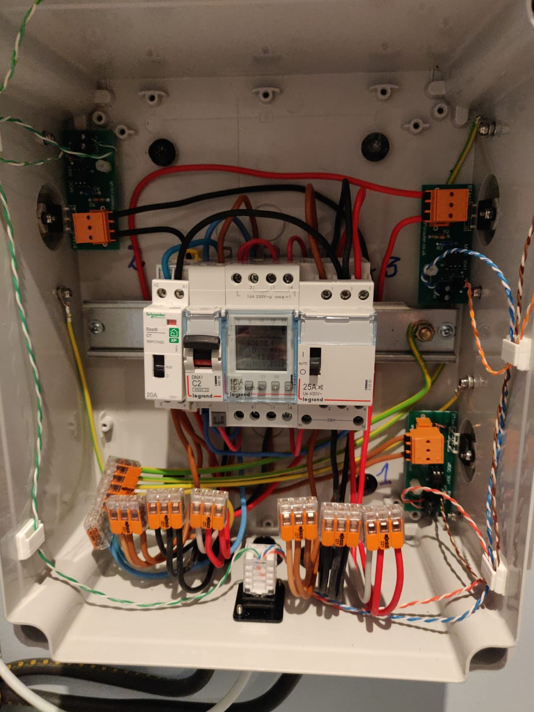
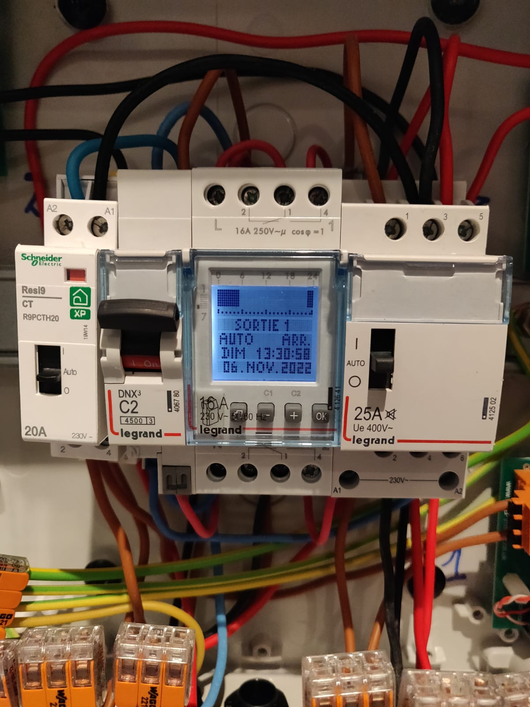
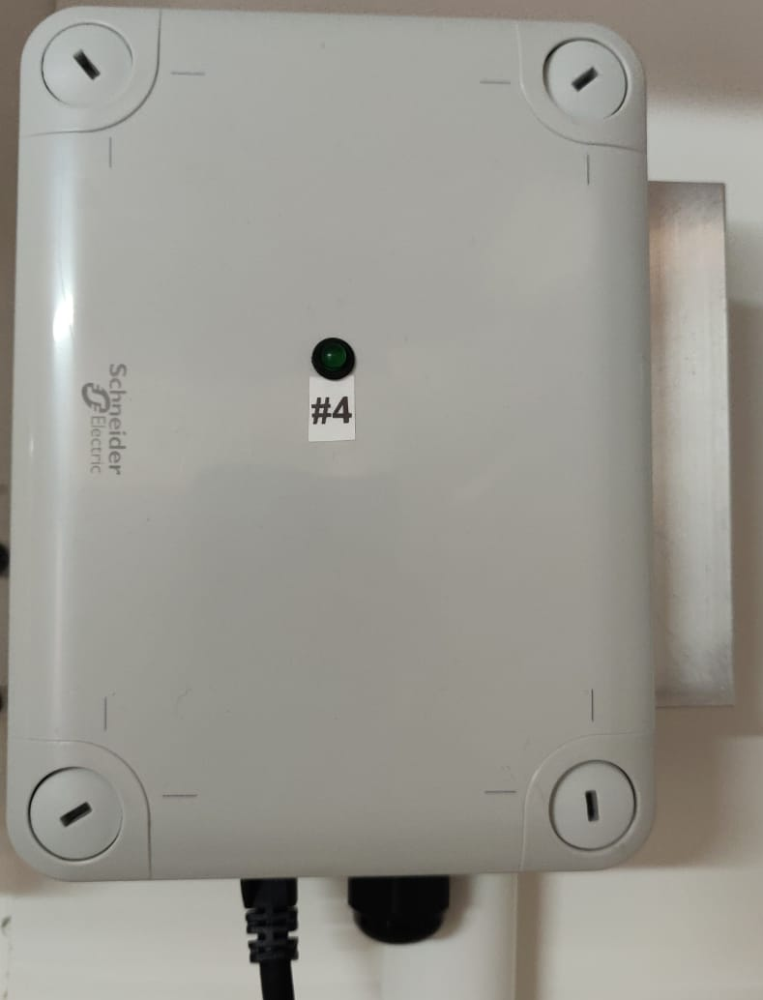
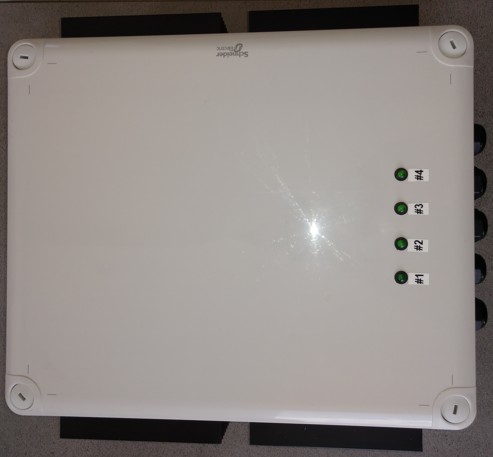
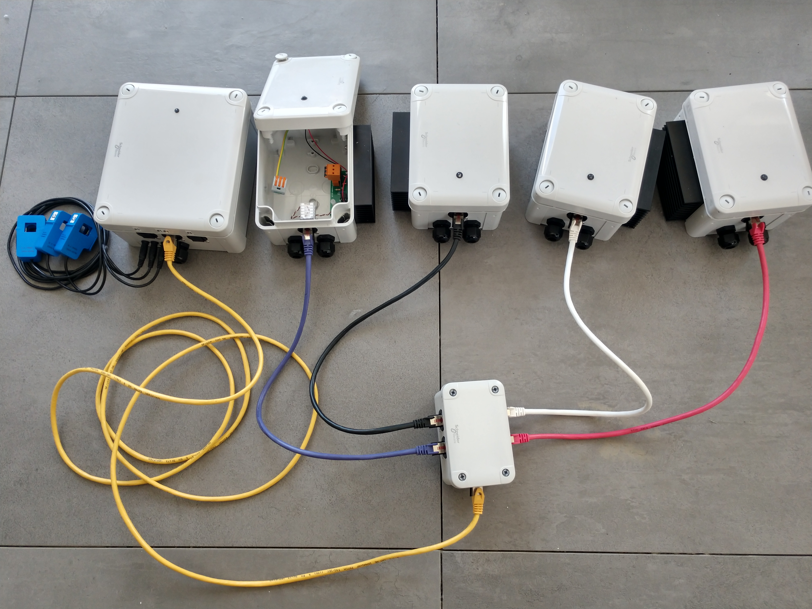
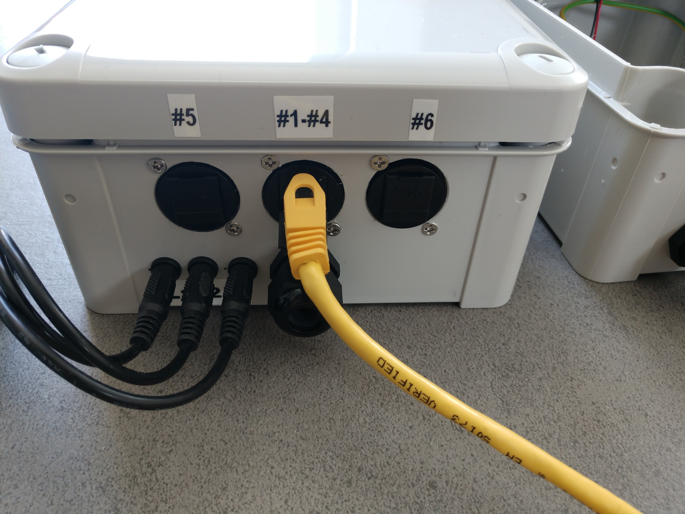
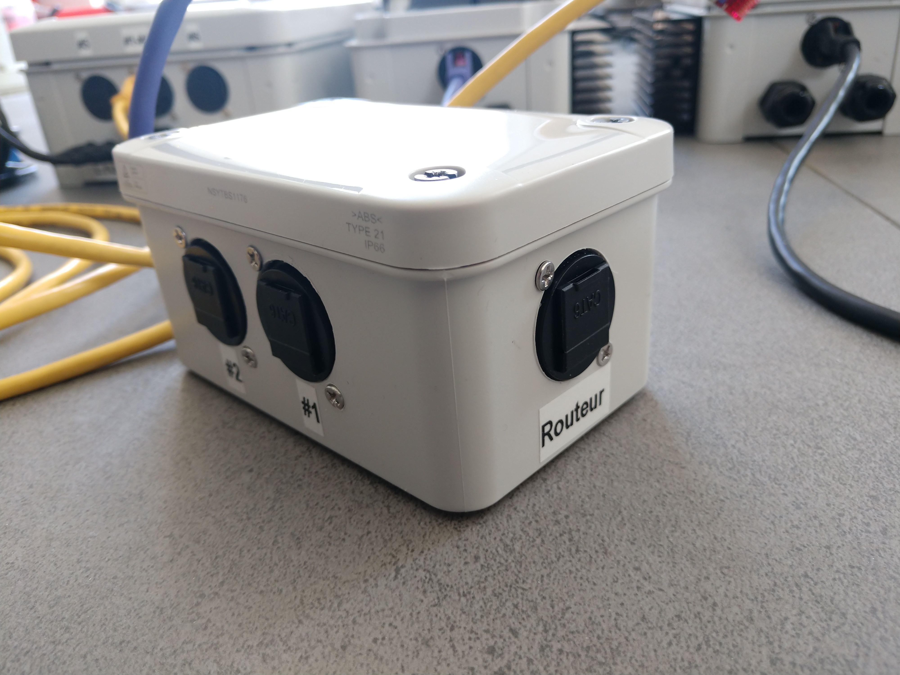

<h1>Galerie photo (version triphasée)</h1>

Quelques une de mes réalisations... d'autres à venir...

- [Routeur triphasé 3 sorties](#routeur-triphasé-3-sorties)
- [Routeur triphasé 4 sorties multi-boîtier (carte-mère, 3 sorties, 1 sortie)](#routeur-triphasé-4-sorties-multi-boîtier-carte-mère-3-sorties-1-sortie)
  - [Boîtier carte-mère](#boîtier-carte-mère)
  - [Boîtier 3 sorties à proximité du chauffe-eau](#boîtier-3-sorties-à-proximité-du-chauffe-eau)
  - [Boîtier 1 sortie déporté](#boîtier-1-sortie-déporté)
- [Routeur triphasé 4 sorties](#routeur-triphasé-4-sorties)
- [Routeur triphasé, 4 sorties distantes par câble (en option 6), sorties connectées par câble réseau, boîte de répartition](#routeur-triphasé-4-sorties-distantes-par-câble-en-option-6-sorties-connectées-par-câble-réseau-boîte-de-répartition)
- [Routeur triphasé, 3 sorties, dont 2 pilotables via Internet (ON/OFF et boost)](#routeur-triphasé-3-sorties-dont-2-pilotables-via-internet-onoff-et-boost)
- [Routeur triphasé, 6 sorties, toutes pilotables via Internet (boost et inversion de priorité)](#routeur-triphasé-6-sorties-toutes-pilotables-via-internet-boost-et-inversion-de-priorité)
- [Routeur triphasé, 8 sorties, pilotées par paire (1-5, 2-6, 3-7, 4-8), boost par groupe (1-2-3, 4, 5-6-7, 8)](#routeur-triphasé-8-sorties-pilotées-par-paire-1-5-2-6-3-7-4-8-boost-par-groupe-1-2-3-4-5-6-7-8)
- [Routeur triphasé, 8 sorties, sorties 4 et 5 pilotées ensemble, 4 groupes de boost (1-2-3, 4, 5, 6-7-8)](#routeur-triphasé-8-sorties-sorties-4-et-5-pilotées-ensemble-4-groupes-de-boost-1-2-3-4-5-6-7-8)

## Routeur triphasé 3 sorties

 

## Routeur triphasé 4 sorties multi-boîtier (carte-mère, 3 sorties, 1 sortie)

### Boîtier carte-mère

### Boîtier 3 sorties à proximité du chauffe-eau
Ce boîtier contient les 3 sorties mais aussi une horloge et un contacteur pour la boost programmée.

 

### Boîtier 1 sortie déporté

## Routeur triphasé 4 sorties

  

## Routeur triphasé, 4 sorties distantes par câble (en option 6), sorties connectées par câble réseau, boîte de répartition

   

## Routeur triphasé, 3 sorties, dont 2 pilotables via Internet (ON/OFF et boost)

  

## Routeur triphasé, 6 sorties, toutes pilotables via Internet (boost et inversion de priorité)

 

## Routeur triphasé, 8 sorties, pilotées par paire (1-5, 2-6, 3-7, 4-8), boost par groupe (1-2-3, 4, 5-6-7, 8)

|  |   |

|  |  |
 |  |

## Routeur triphasé, 8 sorties, sorties 4 et 5 pilotées ensemble, 4 groupes de boost (1-2-3, 4, 5, 6-7-8)
Ce routeur effectue également la rotation des priorités des charges 1, 2 et 3 toutes les 24h.

|  |  |

|  |  |
