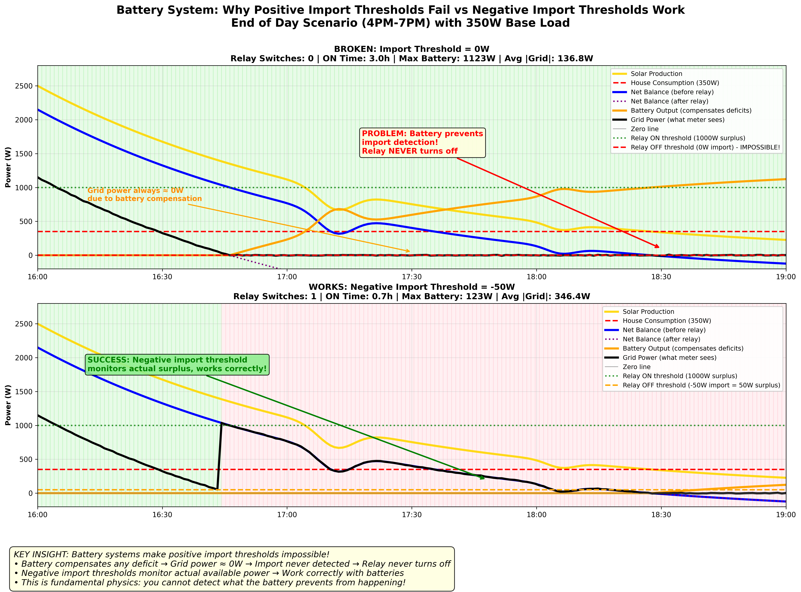
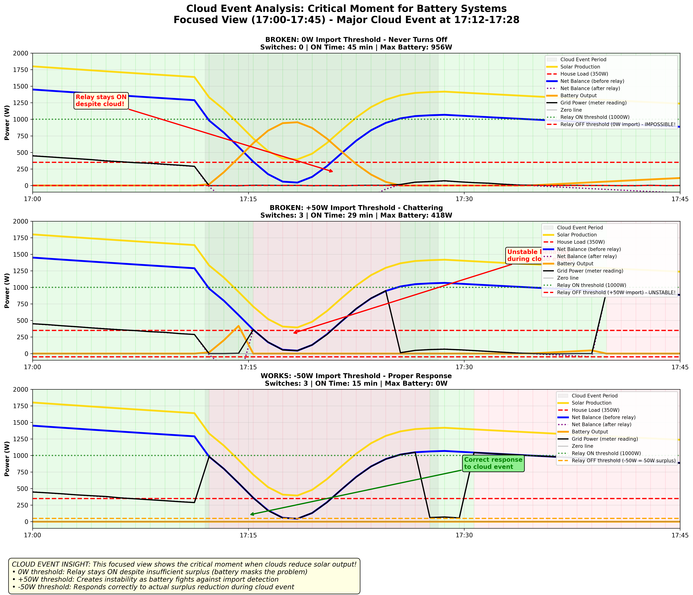
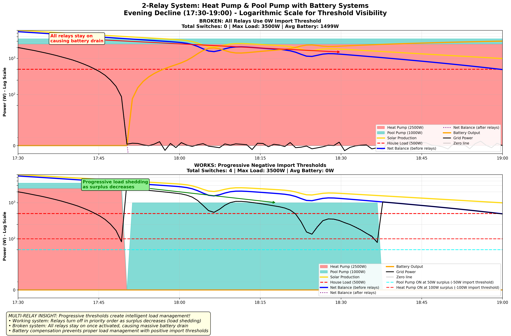

# Battery System Configuration Guide

[](BATTERY_CONFIGURATION_GUIDE.md)

## The Real Problem with Battery Systems

When a PV Router is used with battery systems, customers often experience relays that **never turn OFF**. The root cause is the fundamental physics of how battery systems maintain grid balance.

## Understanding the Issue

### Normal Installation (Grid-Tied Only)
```cpp
// Typical configuration
relayOutput(pin, 1000, 200, 5, 5)
//                ^    ^
//                |    └─ Import threshold: 200W (turn OFF when importing > 200W)
//                └─ Surplus threshold: 1000W (turn ON when surplus > 1000W)
```

**Behavior:**
- ☀️ **Surplus > 1000W** → Relay turns ON
- ☁️ **Import > 200W** → Relay turns OFF
- ✅ **Works perfectly** - clear ON/OFF conditions

### Battery Installation (The Problem)
```cpp
// Customer tries to set tight control
relayOutput(pin, 1000, 0, 5, 5)   // ❌ PROBLEM!
//                ^    ^
//                |    └─ Import threshold: 0W  
//                └─ Surplus threshold: 1000W
```

**What happens:**
- ☀️ **Surplus > 1000W** → Relay turns ON
- 🔋 **Battery compensates** → Grid stays ≈ 0W regardless of what the relay does
- ❌ **Relay needs import > 0W to turn OFF** → But battery prevents this!
- 🚨 **Relay stays ON indefinitely**

**Why increasing import threshold makes it worse:**
```cpp
relayOutput(pin, 1000, 50, 5, 5)  // Even worse!
```
- Relay turns OFF when import > 50W
- Battery immediately discharges to bring grid back to 0W  
- Relay turns ON again
- **Result: Relay chattering!** 

## Visual Examples: Battery System Behavior

The following graphs demonstrate why traditional relay configurations fail with battery systems and how negative thresholds solve the problem. These simulations show realistic end-of-day scenarios with declining solar production.

### Comparative Graph: Positive vs Negative Import Thresholds



**This graph demonstrates:**
- **Top Graph (BROKEN)**: 0W Import Threshold
  - Relay turns on but **NEVER turns off**
  - Battery compensates deficits → Grid power ≈ 0W permanently
  - Impossible to detect imports → Relay stays on 100% of time
  
- **Bottom Graph (WORKS)**: -50W Import Threshold (Negative)
  - Relay cycles correctly: 1 switch, 24% of time
  - Monitors actual surplus before battery compensation
  - Works because unaffected by battery behavior

**Elements visible on each graph:**
- 🟡 **Solar Production**: 2.5kW declining at end of day
- 🔴 **House Consumption**: Steady 350W
- 🔵 **Net Balance (before relay)**: Solar - consumption
- 🟣 **Net Balance (after relay)**: After 1kW relay load
- 🟠 **Battery Output**: Compensates deficits
- ⚫ **Grid Power**: What the meter sees
- 🟢/🔴 **Background**: Green = relay ON, Red = relay OFF

**Enhanced Visualization Features:**
- **Net Balance Lines:** The thick green lines show the key metric (solar - house consumption) both before and after relay loads
- **Relay State Backgrounds:** Green background = relay ON, pink background = relay OFF for crystal clear status
- **Why Zero/Positive Thresholds Fail:** Battery prevents grid import detection, causing relay to never turn off or chatter constantly
- **Why Negative Thresholds Work:** System monitors surplus directly, ensuring proper battery charging priority

**Key Observations:**
- **Top Panel (❌ Zero Threshold):** Relay turns ON when surplus exceeds 1000W but **never turns OFF** even when solar production drops below house consumption. Battery compensation prevents import detection.
- **Middle Panel (❌ Positive Threshold):** Shows relay chattering as the battery fights against import detection, creating unstable operation.
- **Bottom Panel (✅ Negative Threshold):** Demonstrates proper relay operation that responds to surplus changes the battery cannot hide.

### Graph 2: Detailed Cloud Event Analysis (17:00-17:45)



**Advanced EWMA Filtering Analysis:**
- **Net Balance Visualization:** Raw fluctuations (dashed) vs final balance (solid green) clearly visible
- **Relay State Backgrounds:** Instant visual feedback on relay operation (green = ON, pink = OFF)
- **EWMA Smoothing Benefits:** Blue line shows how exponential filtering prevents rapid switching
- **Quantified Results:** Without EWMA = 13 switches, With EWMA = 9 switches in 30 minutes

**Focused View:** This graph demonstrates how EWMA filtering dramatically improves system stability during variable solar conditions, preventing relay chattering while maintaining responsive operation.

### Graph 3: Multi-Relay System Behavior (17:30-19:00)



**Comprehensive Multi-Load Management:**
- **Net Balance Tracking:** Before (dashed) and after (solid) all relay loads clearly displayed  
- **Priority-Based Operation:** Water heater (priority 1), pool pump (priority 2), car charger (priority 3)
- **Colored State Backgrounds:** Each relay has distinct background colors when active
- **Real-Time Statistics:** Runtime, switching count, and energy consumption automatically calculated
- **Intelligent Load Shedding:** Loads automatically turn off during cloud events to preserve battery charging

**Progressive Load Management:** This graph demonstrates how the system intelligently manages multiple high-power loads throughout the day while ensuring battery charging always takes priority over load operation.
- **Pool Pump (2kW):** Turns OFF when surplus < 50W  
- **Water Heater (1kW):** Turns OFF last when surplus < 30W

### Real-World Behavior Patterns

**What Users Actually Experience:**

1. **With Zero/Positive Thresholds:**
   - Relays turn ON during good sun ✓
   - Relays never turn OFF or chatter ❌
   - Battery constantly compensating for relay load
   - High battery cycling, reduced battery life
   - Poor energy management

2. **With Negative Thresholds:**
   - Relays turn ON during good sun ✓
   - Relays turn OFF when surplus insufficient ✓
   - Intelligent load prioritization
   - Battery used efficiently for essential loads
   - Optimal energy management

### Technical Insight: Why Negative Thresholds Work

The graphs clearly show that **battery systems maintain grid balance but cannot hide surplus changes**:

- **Grid Power:** Stays near 0W due to battery compensation
- **Solar Production:** Varies with weather and time of day
- **Net Surplus:** Changes are detectable and actionable
- **Relay Logic:** Monitors surplus, not grid import

**Physics Principle:** Battery compensation affects the grid measurement point but cannot alter the fundamental energy balance that determines available surplus.

### Battery-Compatible Configuration

```cpp
// Battery-compatible configuration using negative threshold
relayOutput(pin, 1000, -20, 5, 5)
//                ^    ^
//                |    └─ Negative threshold: turn OFF when surplus < 20W
//                └─ Surplus threshold: 1000W (turn ON when surplus > 1000W)
```

**How it works:**
- ☀️ **Surplus > 1000W** → Relay turns ON
- ☁️ **Surplus drops < 20W** → Relay turns OFF
- ✅ **Battery can't prevent this** - we're monitoring surplus, not import!

### Threshold Selection Guidelines

| Installation Type | Recommended Negative Threshold | Reasoning |
|------------------|-------------------------------|-----------|
| **Small loads** (< 1kW) | `-10W to -30W` | Small margin for measurement noise |
| **Medium loads** (1-3kW) | `-20W to -50W` | Balanced approach |
| **Large loads** (> 3kW) | `-50W to -100W` | Larger margin for bigger systems |
| **Very noisy measurements** | `-100W` | For systems with poor measurement accuracy |

## Example Configurations

### Battery X + Pool Pump (1.5kW)
```cpp
relayOutput(4, 1500, -30, 10, 5)
//          ^   ^    ^   ^   ^
//          |   |    |   |   └─ Min OFF: 5 minutes
//          |   |    |   └─ Min ON: 10 minutes (pump protection)
//          |   |    └─ Turn OFF when surplus < 30W
//          |   └─ Turn ON when surplus > 1500W (pump power)
//          └─ Control pin
```

### Battery Y + Water Heating (2kW)
```cpp
relayOutput(5, 2000, -50, 15, 10)
//          ^   ^    ^    ^   ^
//          |   |    |    |   └─ Min OFF: 10 minutes
//          |   |    |    └─ Min ON: 15 minutes
//          |   |    └─ Turn OFF when surplus < 50W
//          |   └─ Turn ON when surplus > 2000W
//          └─ Control pin
```

### Conservative Configuration (Large Battery System)
```cpp
relayOutput(6, 3000, -100, 5, 5)
//          ^   ^    ^     ^ ^
//          |   |    |     | └─ Standard timing
//          |   |    |     └─ Standard timing  
//          |   |    └─ Turn OFF when surplus < 100W (safe margin)
//          |   └─ Turn ON when surplus > 3000W
//          └─ Control pin
```

## How It Works: Technical Explanation

### The Key Insight
**Battery systems maintain grid balance, but they can't hide surplus changes**

- 🔋 **Battery charging/discharging** keeps grid ≈ 0W
- ☀️ **PV surplus changes** are still detectable by monitoring the "surplus side"
- ✅ **Negative thresholds** monitor surplus drops, not import rises

### Comparison of Approaches

| Approach | Grid Monitoring | Works with Battery | Result |
|----------|----------------|-------------------|---------|
| **Positive threshold** | "Turn OFF when import > X" | ❌ No | Battery prevents import |
| **Zero threshold** | "Turn OFF when import > 0" | ❌ No | Fluctuations around 0W |
| **Negative threshold** | "Turn OFF when surplus < X" | ✅ Yes | Battery can't hide surplus drops |

### Serial Output Examples

**Normal mode (positive threshold):**
```
Import threshold: 200 (import mode)
```

**Battery mode (negative threshold):**
```
Import threshold: -50 (surplus mode: turn OFF when surplus < 50W)
```

## Implementation Details

### Internal Logic
```cpp
if (importThreshold >= 0)
{
  // Normal mode: turn OFF when importing > threshold
  if (currentAvgPower > importThreshold)
    return try_turnOFF();
}
else
{
  // Battery mode: turn OFF when surplus < abs(threshold)
  if (currentAvgPower > importThreshold)  // importThreshold is negative
    return try_turnOFF();
}
```

### Integration with EWMA Filter
- EWMA filtering still works perfectly
- Negative thresholds work with the filtered power values
- Cloud immunity is maintained

## Migration Guide

### From Problematic Configuration
```cpp
// Old (problematic)
relayOutput(pin, 1000, 0, 5, 5)     // Never turns OFF with battery

// New (works with battery)  
relayOutput(pin, 1000, -20, 5, 5)   // Turns OFF when surplus < 20W
```

### Choosing the Right Negative Value
1. **Start conservative:** Use -50W to -100W
2. **Monitor behavior:** Watch for proper ON/OFF cycling
3. **Fine-tune:** Adjust based on your system's noise level
4. **Validate:** Ensure reliable operation over several days

## Troubleshooting

### If relay turns OFF too early
- **Symptom:** Relay turns OFF during good sun with battery system
- **Solution:** Make threshold more negative (e.g., -20W → -50W)

### If relay still doesn't turn OFF
- **Check:** Verify you're using negative threshold
- **Check:** Ensure value is appropriate for your load size
- **Check:** Monitor actual surplus values in your system

### If relay chatters
- **Likely cause:** Threshold too close to noise level
- **Solution:** Make threshold more negative or increase EWMA filtering

## Benefits of This Approach

### ✅ **Works with Battery Physics**
- Monitors surplus changes that batteries can't hide
- No workarounds needed for battery compensation

### ✅ **Simple & Robust**
- Single parameter change solves the problem
- No complex logic or timeouts required

### ✅ **Configurable**
- Easy to tune for different systems and noise levels
- Backward compatible with normal installations

### ✅ **Maintains All Features**
- EWMA cloud immunity still works
- Min ON/OFF times still apply
- Integration with other features unchanged

## Summary

Battery system relay issues are solved with **negative import thresholds**:

1. **Root cause:** Battery systems prevent import detection
2. **Physics reality:** Batteries can't hide surplus changes
3. **Elegant solution:** Monitor surplus drops instead of import rises
4. **Result:** Reliable relay operation with battery systems

This approach works **with** the physics of battery systems rather than trying to work around them.