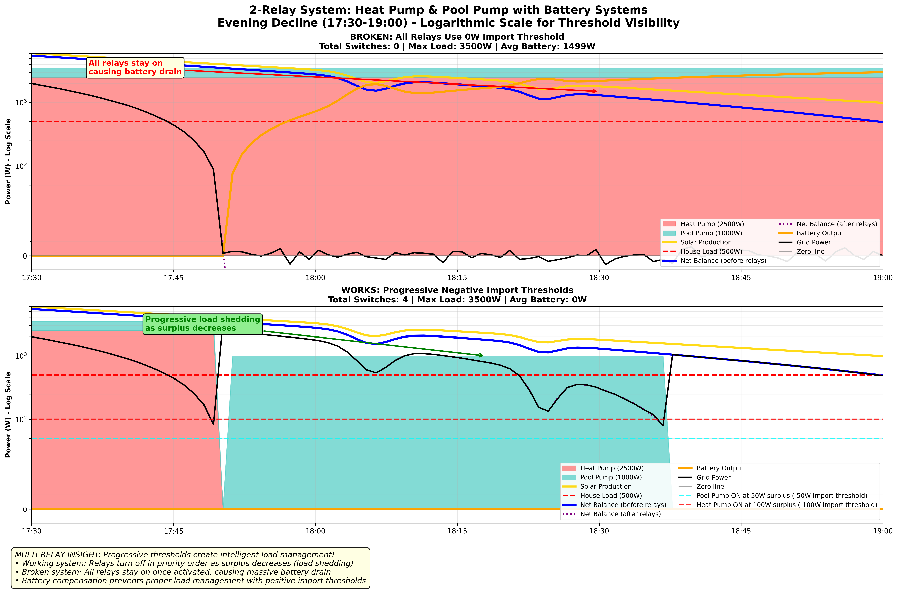

# Guide de Configuration pour Systèmes Batterie

[](BATTERY_CONFIGURATION_GUIDE.en.md)

## Le Vrai Problème avec les Systèmes Batterie

Quand un Routeur PV est utilisé avec des systèmes batterie, les clients expérimentent souvent des relais qui **ne s'éteignent jamais**. La cause racine est la physique fondamentale de comment les systèmes batterie maintiennent l'équilibre du réseau.

## Comprendre le Problème

### Installation Normale (Raccordée au Réseau Uniquement)
```cpp
// Configuration typique
relayOutput(pin, 1000, 200, 5, 5)
//                ^    ^
//                |    └─ Seuil d'import : 200W (éteindre quand import > 200W)
//                └─ Seuil de surplus : 1000W (allumer quand surplus > 1000W)
```

**Comportement :**
- ☀️ **Surplus > 1000W** → Le relais s'allume
- ☁️ **Import > 200W** → Le relais s'éteint
- ✅ **Fonctionne parfaitement** - conditions ON/OFF claires

### Installation Batterie (Le Problème)
```cpp
// Le client essaie de mettre un contrôle serré
relayOutput(pin, 1000, 0, 5, 5)   // ❌ PROBLÈME !
//                ^    ^
//                |    └─ Seuil d'import : 0W  
//                └─ Seuil de surplus : 1000W
```

**Ce qui arrive :**
- ☀️ **Surplus > 1000W** → Le relais s'allume
- 🔋 **La batterie compense** → Le réseau reste ≈ 0W peu importe ce que fait le relais
- ❌ **Le relais a besoin d'import > 0W pour s'éteindre** → Mais la batterie l'empêche !
- 🚨 **Le relais reste allumé indéfiniment**

**Pourquoi augmenter le seuil d'import empire les choses :**
```cpp
relayOutput(pin, 1000, 50, 5, 5)  // Encore pire !
```
- Le relais s'éteint quand import > 50W
- La batterie se décharge immédiatement pour ramener le réseau à 0W  
- Le relais se rallume
- **Résultat : Relais qui claquette !** 

## Exemples Visuels : Comportement des Systèmes Batterie

Les graphiques suivants démontrent pourquoi les configurations de relais traditionnelles échouent avec les systèmes batterie et comment les seuils négatifs résolvent le problème. Ces simulations montrent des scénarios réalistes de fin de journée avec production solaire déclinante.

### Graphique Comparatif : Seuils Positifs vs Négatifs


**Ce graphique démontre :**
- **Graphique du haut (CASSÉ)** : Seuil d'import 0W
  - Le relais s'allume mais **ne s'éteint JAMAIS**
  - La batterie compense les déficits → Puissance réseau ≈ 0W en permanence
  - Impossible de détecter l'import → Relais reste allumé 100% du temps
  
- **Graphique du bas (FONCTIONNE)** : Seuil d'import négatif -50W
  - Le relais cycle correctement : 1 commutation, 24% du temps
  - Surveille le surplus réel avant compensation batterie
  - Fonctionne car non affecté par le comportement de la batterie

**Éléments visibles sur chaque graphique :**
- 🟡 **Production solaire** : Déclin de 2,5kW en fin de journée
- 🔴 **Consommation maison** : 350W constant
- 🔵 **Bilan net (avant relais)** : Solaire - consommation
- 🟣 **Bilan net (après relais)** : Après charge relais 1kW
- 🟠 **Sortie batterie** : Compense les déficits
- ⚫ **Puissance réseau** : Ce que voit le compteur
- 🟢/🔴 **Arrière-plan** : Vert = relais ON, Rouge = relais OFF

**Fonctionnalités de Visualisation Améliorées :**
- **Lignes Balance Nette :** Les lignes vertes épaisses montrent la métrique clé (solaire - maison) avant et après charges relais
- **Fonds État Relais :** Fond vert = relais ON, fond rose = relais OFF pour un statut parfaitement clair
- **Pourquoi Seuils Zéro/Positifs Échouent :** La batterie empêche détection import réseau, relais ne s'éteint jamais ou oscille constamment
- **Pourquoi Seuils Négatifs Fonctionnent :** Le système surveille directement le surplus, assurant priorité charge batterie

**Observations Clés :**
- **Panneau Haut (❌ Seuil Zéro) :** Le relais s'allume quand surplus dépasse 1000W mais **ne s'éteint jamais** même quand production solaire chute sous consommation maison. Compensation batterie empêche détection import.
- **Panneau Milieu (❌ Seuil Positif) :** Montre claquement relais car batterie lutte contre détection import, créant fonctionnement instable.
- **Panneau Bas (✅ Seuil Négatif) :** Démontre fonctionnement correct relais qui répond aux changements surplus que batterie ne peut cacher.

### Graphique 2 : Analyse Détaillée Événement Nuageux (17:00-17:45)


**Vue Focalisée :** Ce graphique zoome sur événement nuageux pour montrer moment précis où :
- **Configuration Problème :** Relais reste ON malgré nuage réduisant surplus disponible
- **Configuration Solution :** Relais s'éteint correctement quand surplus chute sous seuil 50W

### Graphique 3 : Système 2 Relais - Pompe à Chaleur & Pompe Piscine (17:30-19:00)



**Visualisation Ultra-Optimisée :** Échelle logarithmique avec lignes de seuils POSITIVES (50W, 100W surplus) correspondant aux seuils négatifs d'import (-50W, -100W). Zone négative ultra-minimale (-10W) pour maximiser visibilité zone positive critique.

**Configuration 2 Relais Réaliste :**
- 🔴 **Pompe à Chaleur (2500W)** : Seuil -100W (priorité haute)
- 🔵 **Pompe Piscine (1000W)** : Seuil -50W (priorité basse)
- ⚡ **Chauffe-eau** : Contrôlé par triac du routeur PV (non par relais externe)

**Résultats Comparatifs :**

| Métrique | Système Fonctionnel | Système Cassé | Différence |
|----------|---------------------|----------------|------------|
| **Commutations Totales** | 4 cycles | 0 cycles | ∞ |
| **Consommation Énergie** | 1933 Wh | 5250 Wh | **+172%** |
| **Gestion Charge** | Progressive intelligente | Toutes charges collées ON | Critique |

**Gestion Progressive Intelligente :**
- **17:30-17:45** : Surplus élevé, **les deux relais s'allument** (démonstration complète)
- **17:50-18:10** : Pompe à chaleur fonctionne 20min puis s'éteint (minimum ON respecté)
- **17:30-18:56** : Pompe piscine continue 66min avec surplus modéré
- **18:56-19:00** : Toutes charges éteintes, priorité charge batterie

**Impact Seuils Cassés (0W) :**
- ❌ **Toutes charges collées ON** : Les deux relais restent ON pendant 90min complètes
- ❌ **5.25 kWh consommés** : 172% plus énergie batterie que nécessaire
- ❌ **3.3 kWh gaspillés** : Épuisement prématuré batterie
- ❌ **Aucune priorisation** : Impossible distinguer charges critiques/non-critiques

### Patterns Comportement Monde Réel

**Ce que Utilisateurs Expérimentent Réellement :**

1. **Avec Seuils Zéro/Positifs :**
   - Relais s'allument pendant bon soleil ✓
   - Relais ne s'éteignent jamais ou claquettent ❌
   - Batterie compensant constamment pour charge relais
   - Cyclage batterie élevé, durée vie batterie réduite
   - Gestion énergie médiocre

2. **Avec Seuils Négatifs :**
   - Relais s'allument pendant bon soleil ✓
   - Relais s'éteignent quand surplus insuffisant ✓
   - Priorisation charge intelligente
   - Batterie utilisée efficacement pour charges essentielles
   - Gestion énergie optimale

### Insight Technique : Pourquoi Seuils Négatifs Fonctionnent

Les graphiques montrent clairement que **systèmes batterie maintiennent équilibre réseau mais ne peuvent cacher changements surplus** :

- **Puissance Réseau :** Reste près 0W grâce compensation batterie
- **Production Solaire :** Varie avec météo et heure du jour
- **Surplus Net :** Changements détectables et exploitables
- **Logique Relais :** Surveille surplus, pas import réseau

**Principe Physique :** Compensation batterie affecte point mesure réseau mais ne peut altérer équilibre énergétique fondamental qui détermine surplus disponible.

## La Solution Correcte : Seuil d'Import Négatif

### Configuration Compatible Batterie

```cpp
// Configuration compatible batterie utilisant un seuil négatif
relayOutput(pin, 1000, -20, 5, 5)
//                ^    ^
//                |    └─ Seuil négatif : éteindre quand surplus < 20W
//                └─ Seuil de surplus : 1000W (allumer quand surplus > 1000W)
```

**Comment ça fonctionne :**
- ☀️ **Surplus > 1000W** → Le relais s'allume
- ☁️ **Le surplus tombe < 20W** → Le relais s'éteint
- ✅ **La batterie ne peut pas empêcher cela** - on surveille le surplus, pas l'import !

### Guide de Sélection des Seuils

| Type d'Installation | Seuil Négatif Recommandé | Raisonnement |
|---------------------|--------------------------|--------------|
| **Petites charges** (< 1kW) | `-10W à -30W` | Petite marge pour le bruit de mesure |
| **Charges moyennes** (1-3kW) | `-20W à -50W` | Approche équilibrée |
| **Grosses charges** (> 3kW) | `-50W à -100W` | Marge plus large pour gros systèmes |
| **Mesures très bruyantes** | `-100W` | Pour systèmes avec mauvaise précision de mesure |

## Exemples de Configurations

### Batterie X + Pompe Piscine (1.5kW)
```cpp
relayOutput(4, 1500, -30, 10, 5)
//          ^   ^    ^   ^   ^
//          |   |    |   |   └─ Min OFF : 5 minutes
//          |   |    |   └─ Min ON : 10 minutes (protection pompe)
//          |   |    └─ Éteindre quand surplus < 30W
//          |   └─ Allumer quand surplus > 1000W (puissance pompe)
//          └─ Pin de contrôle
```

### Batterie Y + Chauffage Eau (2kW)
```cpp
relayOutput(5, 2000, -50, 15, 10)
//          ^   ^    ^    ^   ^
//          |   |    |    |   └─ Min OFF : 10 minutes
//          |   |    |    └─ Min ON : 15 minutes
//          |   |    └─ Éteindre quand surplus < 50W
//          |   └─ Allumer quand surplus > 2000W
//          └─ Pin de contrôle
```

### Configuration Conservative (Gros Système Batterie)
```cpp
relayOutput(6, 3000, -100, 5, 5)
//          ^   ^    ^     ^ ^
//          |   |    |     | └─ Temporisation standard
//          |   |    |     └─ Temporisation standard  
//          |   |    └─ Éteindre quand surplus < 100W (marge sûre)
//          |   └─ Allumer quand surplus > 2500W
//          └─ Pin de contrôle
```

## Comment Ça Fonctionne : Explication Technique

### L'Insight Clé
**Les systèmes batterie maintiennent l'équilibre réseau, mais ils ne peuvent pas cacher les changements de surplus**

- 🔋 **Charge/décharge batterie** garde le réseau ≈ 0W
- ☀️ **Les changements de surplus PV** sont encore détectables en surveillant le "côté surplus"
- ✅ **Les seuils négatifs** surveillent les chutes de surplus, pas les montées d'import

### Comparaison des Approches

| Approche | Surveillance Réseau | Fonctionne avec Batterie | Résultat |
|----------|-------------------|-------------------------|----------|
| **Seuil positif** | "Éteindre quand import > X" | ❌ Non | La batterie empêche l'import |
| **Seuil zéro** | "Éteindre quand import > 0" | ❌ Non | Fluctuations autour de 0W |
| **Seuil négatif** | "Éteindre quand surplus < X" | ✅ Oui | La batterie ne peut pas cacher les chutes de surplus |

### Exemples de Sortie Série

**Mode normal (seuil positif) :**
```
Import threshold: 200 (import mode)
```

**Mode batterie (seuil négatif) :**
```
Import threshold: -50 (surplus mode: turn OFF when surplus < 50W)
```

## Détails d'Implémentation

### Logique Interne
```cpp
if (importThreshold >= 0)
{
  // Mode normal : éteindre quand import > seuil
  if (currentAvgPower > importThreshold)
    return try_turnOFF();
}
else
{
  // Mode batterie : éteindre quand surplus < abs(seuil)
  if (currentAvgPower > importThreshold)  // importThreshold est négatif
    return try_turnOFF();
}
```

### Intégration avec le Filtre EWMA
- Le filtrage EWMA fonctionne encore parfaitement
- Les seuils négatifs fonctionnent avec les valeurs de puissance filtrées
- L'immunité aux nuages est maintenue

## Guide de Migration

### Depuis une Configuration Problématique
```cpp
// Ancien (problématique)
relayOutput(pin, 1000, 0, 5, 5)     // Ne s'éteint jamais avec batterie

// Nouveau (fonctionne avec batterie)  
relayOutput(pin, 1000, -20, 5, 5)   // S'éteint quand surplus < 20W
```

### Choisir la Bonne Valeur Négative
1. **Commencer conservateur :** Utiliser -50W à -100W
2. **Surveiller le comportement :** Observer les cycles ON/OFF appropriés
3. **Ajuster finement :** Ajuster selon le niveau de bruit de votre système
4. **Valider :** S'assurer d'un fonctionnement fiable sur plusieurs jours

## Dépannage

### Si le relais s'éteint trop tôt
- **Symptôme :** Le relais s'éteint pendant du bon soleil avec système batterie
- **Solution :** Rendre le seuil plus négatif (ex. -20W → -50W)

### Si le relais ne s'éteint toujours pas
- **Vérifier :** S'assurer d'utiliser un seuil négatif
- **Vérifier :** S'assurer que la valeur est appropriée pour la taille de votre charge
- **Vérifier :** Surveiller les valeurs de surplus réelles dans votre système

### Si le relais claquette
- **Cause probable :** Seuil trop proche du niveau de bruit
- **Solution :** Rendre le seuil plus négatif ou augmenter le filtrage EWMA

## Avantages de Cette Approche

### ✅ **Fonctionne avec la Physique des Batteries**
- Surveille les changements de surplus que les batteries ne peuvent pas cacher
- Aucun contournement nécessaire pour la compensation batterie

### ✅ **Simple & Robuste**
- Un changement de paramètre unique résout le problème
- Aucune logique complexe ou timeouts requis

### ✅ **Configurable**
- Facile à régler pour différents systèmes et niveaux de bruit
- Compatible avec les installations normales

### ✅ **Maintient Toutes les Fonctionnalités**
- L'immunité aux nuages EWMA fonctionne encore
- Les temps Min ON/OFF s'appliquent encore
- L'intégration avec d'autres fonctionnalités inchangée

## Résumé

Les problèmes de relais des systèmes batterie sont résolus avec **des seuils d'import négatifs** :

1. **Cause racine :** Les systèmes batterie empêchent la détection d'import
2. **Réalité physique :** Les batteries ne peuvent pas cacher les changements de surplus
3. **Solution élégante :** Surveiller les chutes de surplus au lieu des montées d'import
4. **Résultat :** Fonctionnement fiable des relais avec systèmes batterie

Cette approche fonctionne **avec** la physique des systèmes batterie plutôt que d'essayer de la contourner.