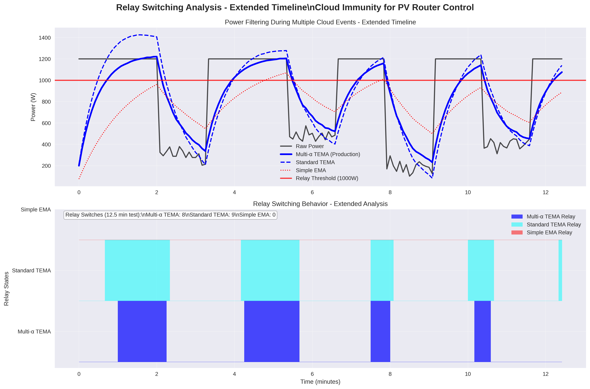

# PVRouter Analysis Tools

[](README.md) [](README.en.md)

[🇫🇷 Français](README.md) | **🌐 English**

---

This directory contains analysis tools and documentation for the PVRouter-3-phase project.

## Directory Structure

```
analysis/
├── README.md                 # French version (main)
├── README.en.md             # This file
├── ewma/                    # EWMA/TEMA filtering analysis
│   ├── TEMA_ANALYSIS_README.md        # French version (main)
│   ├── TEMA_ANALYSIS_README.en.md     # English version
│   ├── EWMA_TUNING_GUIDE.md          # French version (main)
│   └── EWMA_TUNING_GUIDE.en.md       # English version
├── scripts/                 # Analysis and visualization scripts
│   ├── ema_effectiveness_analysis_extended.py
│   └── tema_comparison.py
└── plots/                   # Generated analysis plots
    ├── ema_dema_tema_comparison.png
    ├── ema_dema_tema_comparison_extended.png
    ├── filter_performance_analysis.png
    ├── relay_switching_analysis.png
    ├── relay_switching_analysis_extended.png
    └── tema_implementation_comparison.png
```

## Available Analysis Tools

### EWMA/TEMA Filtering Analysis

**Location**: `ewma/`

- **TEMA_ANALYSIS_README.md**: Comprehensive documentation of the Triple Exponential Moving Average (TEMA) implementation and its benefits for cloud immunity in PV routing applications.
- **EWMA_TUNING_GUIDE.md**: EWMA filter tuning guide for different weather conditions and installations.

### Analysis Scripts

**Location**: `scripts/`

- **ema_effectiveness_analysis_extended.py**: Comprehensive comparison of EMA, DEMA, and TEMA filtering effectiveness with extended scenarios showing long-term stabilization.
- **tema_comparison.py**: Focused comparison between multi-alpha TEMA (production implementation) and standard single-alpha TEMA.

### Cloud Pattern Visualization

**Location**: `../Mk2_3phase_RFdatalog_temp/scripts/`

- **visualize_cloud_patterns.py**: Main cloud pattern visualization tool matching production TEMA implementation.
- **visualize_cloud_patterns_demo.py**: Demo version with simplified scenarios.

## Running Analysis

### Requirements

```bash
pip3 install matplotlib numpy
```

### Quick Start

```bash
# Run comprehensive filter analysis
cd analysis/scripts
python3 ema_effectiveness_analysis_extended.py

# Run TEMA comparison
python3 tema_comparison.py

# Run cloud pattern visualization
cd ../../Mk2_3phase_RFdatalog_temp/scripts
python3 visualize_cloud_patterns.py
```

## Generated Plots

All plots are saved to `analysis/plots/` and include:

### Filter Effectiveness Comparison


*Comprehensive comparison of EMA, DEMA, and TEMA response to cloud patterns with extended stabilization periods*

### Relay Switching Analysis


*How different filters affect relay switching frequency during cloud events*

### TEMA Implementation Comparison


*Multi-alpha vs single-alpha TEMA performance comparison*

### Additional Analysis Plots

- **Filter Performance Analysis**: `plots/filter_performance_analysis.png`
- **Basic Comparisons**: `plots/ema_dema_tema_comparison.png`, `plots/relay_switching_analysis.png`

## Key Findings

1. **Multi-Alpha TEMA**: The production code uses a superior multi-alpha approach where each EMA level has different smoothing factors.
2. **Cloud Immunity**: TEMA provides excellent immunity to cloud-induced power fluctuations while maintaining responsiveness.
3. **Relay Stability**: Proper filtering significantly reduces unnecessary relay switching, extending hardware lifetime.

## Practical Benefits

### For Solar Installations
- 🌤️ **Cloud Immunity**: Ignores brief shadows while reacting to real changes
- ⚡ **Optimal Responsiveness**: Perfect balance between stability and response time
- 🔧 **Less Wear**: Drastic reduction in relay switching

### For Grid Stability
- 📊 **Smooth Transitions**: Stable power flow to the grid
- 🎯 **Precise Control**: Optimal energy diversion management
- 🛡️ **Hardware Protection**: Extended relay lifetime

## Integration with Production Code

The analysis scripts are designed to match the filtering implementation in:
- `Mk2_3phase_RFdatalog_temp/ewma_avg.hpp` (C++ production code)

This ensures that analysis results directly reflect real-world performance.

## Multi-Language Support / Support Multilingue

📖 **Documentation available in two languages / Documentation disponible en deux langues:**

| 🇫🇷 **Français** | 🌐 **English** (This version) |
|-------------------|----------------------------------|
| [README.md](README.md) | [README.en.md](README.en.md) |
| [TEMA_ANALYSIS_README.md](ewma/TEMA_ANALYSIS_README.md) | [TEMA_ANALYSIS_README.en.md](ewma/TEMA_ANALYSIS_README.en.md) |
| [EWMA_TUNING_GUIDE.md](ewma/EWMA_TUNING_GUIDE.md) | [EWMA_TUNING_GUIDE.en.md](ewma/EWMA_TUNING_GUIDE.en.md) |

File, function, and variable names remain in English for code compatibility.
