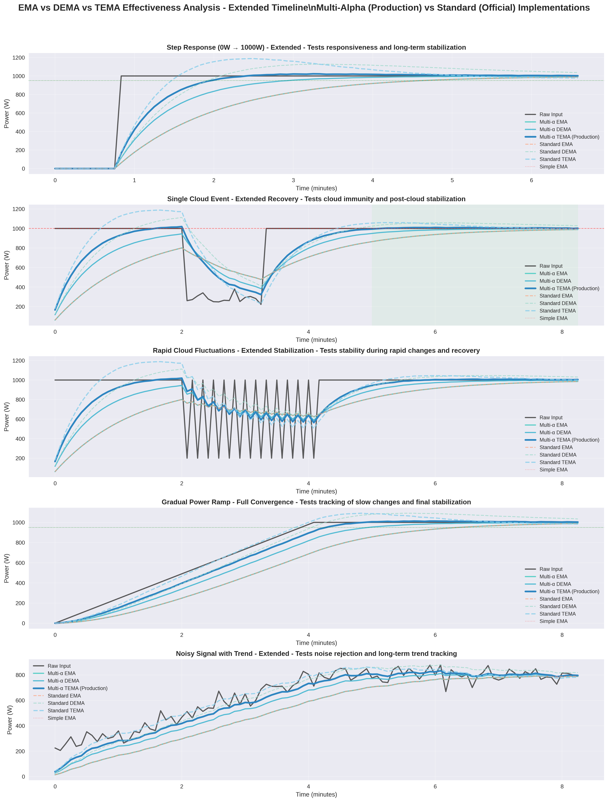
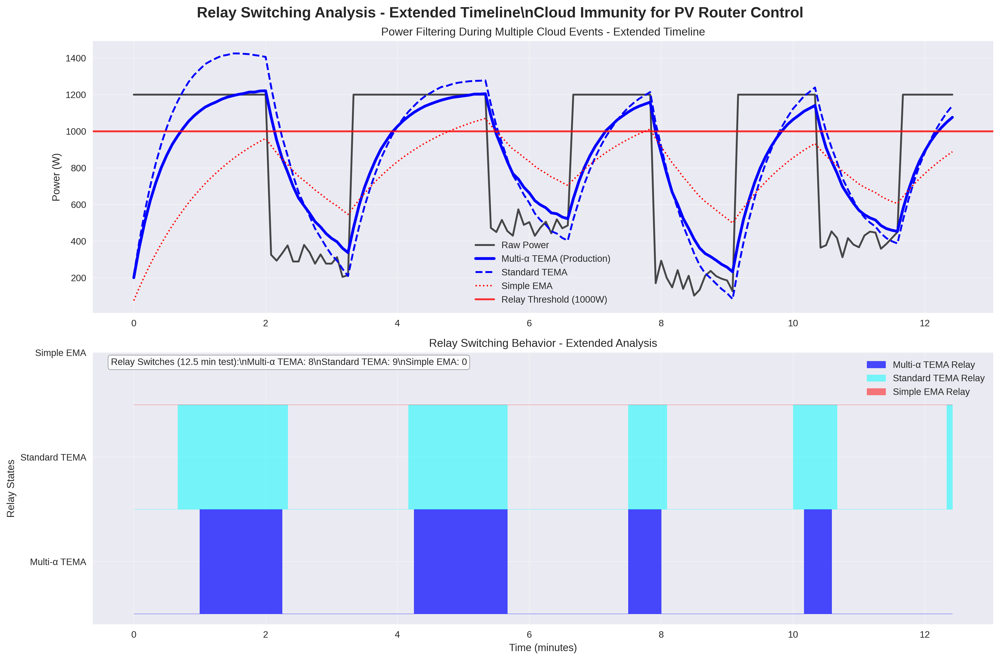
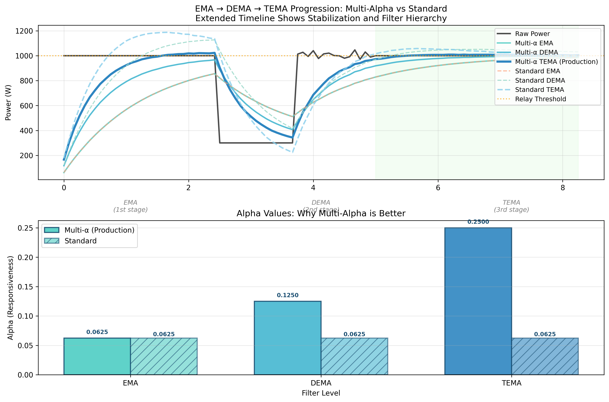

# Outils d'Analyse PVRouter

[](README.md) [](README.en.md)

---

Ce répertoire contient les outils d'analyse et la documentation pour le projet PVRouter-3-phase.

## Structure du Répertoire

```
analysis/
├── README.md                 # Ce fichier
├── ewma/                     # Analyse du filtrage EWMA/TEMA
│   ├── TEMA_ANALYSIS_README.md        # Version française (principale)
│   ├── TEMA_ANALYSIS_README.en.md     # Version anglaise
│   ├── EWMA_TUNING_GUIDE.md          # Version française (principale)
│   └── EWMA_TUNING_GUIDE.en.md       # Version anglaise
├── scripts/                  # Scripts d'analyse et de visualisation
│   ├── ema_effectiveness_analysis_extended.py
│   └── tema_comparison.py
└── plots/                    # Graphiques d'analyse générés
    ├── ema_dema_tema_comparison.png
    ├── ema_dema_tema_comparison_extended.png
    ├── filter_performance_analysis.png
    ├── relay_switching_analysis.png
    ├── relay_switching_analysis_extended.png
    └── tema_implementation_comparison.png
```

## Outils d'Analyse Disponibles

### Analyse du Filtrage EWMA/TEMA

**Emplacement** : `ewma/`

- **TEMA_ANALYSIS_README.md** : Documentation complète de l'implémentation Triple Exponential Moving Average (TEMA) et ses avantages pour l'immunité aux nuages dans les applications de routage PV.
- **EWMA_TUNING_GUIDE.md** : Guide de réglage des filtres EWMA pour différentes conditions météorologiques et installations.

### Scripts d'Analyse

**Emplacement** : `scripts/`

- **ema_effectiveness_analysis_extended.py** : Comparaison complète de l'efficacité du filtrage EMA, DEMA et TEMA avec des scénarios étendus montrant la stabilisation à long terme.
- **tema_comparison.py** : Comparaison ciblée entre TEMA multi-alpha (implémentation de production) et TEMA single-alpha standard.

### Visualisation des Motifs Nuageux

**Emplacement** : `../Mk2_3phase_RFdatalog_temp/scripts/`

- **visualize_cloud_patterns.py** : Outil principal de visualisation des motifs nuageux correspondant à l'implémentation TEMA de production.
- **visualize_cloud_patterns_demo.py** : Version de démonstration avec des scénarios simplifiés.

## Exécution des Analyses

### Prérequis

```bash
pip3 install matplotlib numpy
```

### Démarrage Rapide

```bash
# Exécuter l'analyse complète des filtres
cd analysis/scripts
python3 ema_effectiveness_analysis_extended.py

# Exécuter la comparaison TEMA
python3 tema_comparison.py

# Exécuter la visualisation des motifs nuageux
cd ../../Mk2_3phase_RFdatalog_temp/scripts
python3 visualize_cloud_patterns.py
```

## Graphiques Générés

Tous les graphiques sont sauvegardés dans `analysis/plots/` et incluent :

### Comparaison de l'Efficacité des Filtres


*Comparaison complète de la réponse EMA, DEMA et TEMA aux motifs nuageux avec des périodes de stabilisation étendues*

### Analyse de Commutation des Relais


*Comment les différents filtres affectent la fréquence de commutation des relais lors d'événements nuageux*

### Comparaison des Implémentations TEMA


*Comparaison des performances TEMA multi-alpha vs single-alpha*

### Graphiques d'Analyse Supplémentaires

- **Analyse des Performances des Filtres** : `plots/filter_performance_analysis.png`
- **Comparaisons de Base** : `plots/ema_dema_tema_comparison.png`, `plots/relay_switching_analysis.png`

## Résultats Clés

1. **TEMA Multi-Alpha** : Le code de production utilise une approche multi-alpha supérieure où chaque niveau EMA a des facteurs de lissage différents.
2. **Immunité aux Nuages** : TEMA fournit une excellente immunité aux fluctuations de puissance induites par les nuages tout en maintenant la réactivité.
3. **Stabilité des Relais** : Un filtrage approprié réduit significativement les commutations inutiles des relais, prolongeant la durée de vie du matériel.

## Avantages Pratiques

### Pour les Installations Solaires
- 🌤️ **Immunité aux Nuages** : Ignore les ombres passagères tout en réagissant aux vrais changements
- ⚡ **Réactivité Optimale** : Équilibre parfait entre stabilité et temps de réponse
- 🔧 **Moins d'Usure** : Réduction drastique des commutations de relais

### Pour la Stabilité du Réseau
- 📊 **Transitions Lisses** : Flux de puissance stable vers le réseau
- 🎯 **Contrôle Précis** : Gestion optimale de la diversion d'énergie
- 🛡️ **Protection Matérielle** : Prolongation de la durée de vie des relais

## Intégration avec le Code de Production

Les scripts d'analyse sont conçus pour correspondre à l'implémentation de filtrage dans :
- `Mk2_3phase_RFdatalog_temp/ewma_avg.hpp` (code de production C++)

Cela garantit que les résultats d'analyse reflètent directement les performances dans le monde réel.

## Support Multilingue / Language Support

📖 **Documentation disponible en deux langues / Documentation available in two languages:**

| 🇫🇷 **Français** (Principal) | � **English** |
|-------------------------------|------------------|
| [README.md](README.md) | [README.en.md](README.en.md) |
| [TEMA_ANALYSIS_README.md](ewma/TEMA_ANALYSIS_README.md) | [TEMA_ANALYSIS_README.en.md](ewma/TEMA_ANALYSIS_README.en.md) |
| [EWMA_TUNING_GUIDE.md](ewma/EWMA_TUNING_GUIDE.md) | [EWMA_TUNING_GUIDE.en.md](ewma/EWMA_TUNING_GUIDE.en.md) |

Les noms de fichiers, fonctions et variables restent en anglais pour la compatibilité du code.