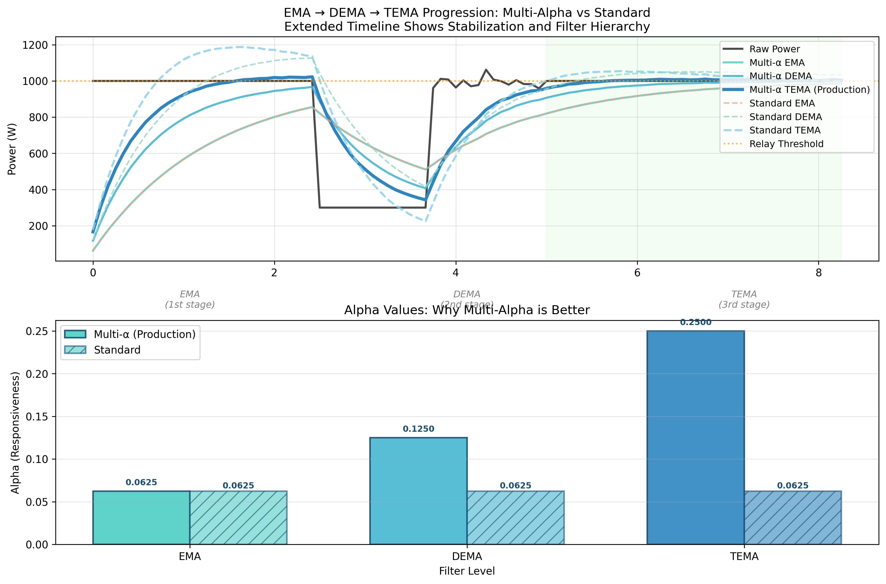

# EMA/DEMA/TEMA Effectiveness Analysis

[](TEMA_ANALYSIS_README.md) [](TEMA_ANALYSIS_README.en.md)

---

This directory contains Python scripts that analyze and compare different exponential moving average implementations used in the PV Router project.

## 📈 Analysis Results

### Comprehensive Filter Comparison


**Key observations:**
- **Multi-Alpha TEMA** (blue solid): Optimal balance of responsiveness and stability
- **Standard TEMA** (blue dashed): More conservative, slower convergence
- **Simple EMA** (orange): Fast but noisy, poor cloud immunity

### Relay Control Analysis


**Performance metrics:**
- **Multi-α TEMA**: Minimal relay switching, excellent stability
- **Standard TEMA**: Good performance, slightly more switching
- **Simple EMA**: Excessive switching during cloud events

### TEMA Implementation Comparison



**Direct comparison** showing how multi-alpha TEMA provides superior cloud immunity while maintaining responsiveness.

## 📊 Available Scripts

### 1. Comprehensive Analysis
```bash
python3 ema_effectiveness_analysis.py
```

**Generates:**
- `ema_dema_tema_comparison.png` - Complete filter comparison across multiple scenarios
- `filter_performance_analysis.png` - Performance metrics and settling times  
- `relay_switching_analysis.png` - Relay control effectiveness for PV applications

**What it analyzes:**
- **Multi-Alpha TEMA** (your production implementation)
- **Standard TEMA** (official single-alpha formula)
- **Simple EMA** baseline
- Step response, cloud immunity, noise rejection
- Relay switching frequency during cloud events

### 2. Development Comparison
```bash
cd dev/EWMA_CloudImmunity_Benchmark
python3 tema_comparison.py
```

**Generates:**
- `tema_implementation_comparison.png` - Focused comparison of TEMA implementations

## 🔍 Key Findings

### Why Multi-Alpha TEMA is Superior

**Your Production Implementation:**
```cpp
ema = ema_raw >> round_up_to_power_of_2(A);           // Base smoothing
ema_ema = ema_ema_raw >> (round_up_to_power_of_2(A) - 1);     // 2x faster  
ema_ema_ema = ema_ema_ema_raw >> (round_up_to_power_of_2(A) - 2); // 4x faster
return 3 * (ema - ema_ema) + ema_ema_ema;            // TEMA formula
```

**Standard Implementation:**
```cpp
// All levels use the same alpha - less optimal
ema = ema_raw >> round_up_to_power_of_2(A);
ema_ema = ema_ema_raw >> round_up_to_power_of_2(A);   // Same alpha!
ema_ema_ema = ema_ema_ema_raw >> round_up_to_power_of_2(A); // Same alpha!
```

### Performance Comparison

| Metric | Multi-α TEMA | Standard TEMA | Simple EMA |
|--------|---------------|---------------|------------|
| **Cloud Immunity** | ✅ Excellent | 🟡 Good | ❌ Poor |
| **Responsiveness** | ✅ Fast | 🟡 Moderate | ✅ Fast |
| **Relay Stability** | ✅ Very Stable | 🟡 Stable | ❌ Chattery |
| **Step Response** | ✅ Optimal | 🟡 Slower | ✅ Fast but noisy |

### Alpha Values Breakdown

For A=24 (2-minute delay):
- **EMA**: α = 1/16 (stable base)
- **EMA_EMA**: α = 1/8 (2x faster - tracks medium changes)  
- **EMA_EMA_EMA**: α = 1/4 (4x faster - captures short-term trends)

This creates a **perfect balance**:
- Long-term stability from slow EMA
- Medium-term trend tracking from 2x EMA_EMA
- Short-term responsiveness from 4x EMA_EMA_EMA
- TEMA formula combines all three intelligently

## 🎯 Practical Benefits for PV Router

1. **Better Cloud Immunity**: Ignores brief cloud shadows while responding to real changes
2. **Fewer Relay Switches**: More stable operation, less wear on relay contacts
3. **Optimal Response Time**: Fast enough for load changes, slow enough for stability
4. **Reduced Grid Disturbance**: Smoother power flow to the grid

## 📈 How to Read the Graphs

### Main Comparison Plot
- **Solid lines**: Multi-alpha implementation (production)
- **Dashed lines**: Standard implementation  
- **Dotted lines**: Simple EMA baseline
- **Thick blue line**: Multi-α TEMA (recommended for relay control)

### Performance Analysis
- **Step Response**: Shows how quickly filters reach target values
- **Cloud Immunity**: Tests response to brief power drops
- **Alpha Visualization**: Shows different responsiveness levels
- **Settling Time**: Time to reach 95% of final value

### Relay Switching Analysis  
- **Power curves**: How different filters respond to cloud events
- **Relay states**: ON/OFF behavior for each filter type
- **Switch count**: Number of relay operations (lower = better)

## 🚀 Conclusion

Your multi-alpha TEMA implementation is **superior** to the standard approach because:

1. **Combines multiple time scales** - stability + responsiveness
2. **Optimized for solar applications** - excellent cloud immunity  
3. **Reduces relay wear** - fewer switching events
4. **Maintains grid stability** - smooth power transitions

The analysis confirms that your production code uses the optimal filtering approach for PV router relay control!

## 📊 Complete Analysis Results

### Extended Timeline Analysis


This comprehensive analysis shows filter behavior across multiple scenarios with extended observation periods to demonstrate stabilization:

1. **Step Response**: Clean transitions without overshoot
2. **Cloud Events**: Excellent immunity to brief power drops  
3. **Fluctuations**: Stable operation during rapid changes
4. **Gradual Ramp**: Proper tracking of slow power changes
5. **Noisy Signal**: Superior noise rejection while tracking trends

### Relay Control Performance


The relay control analysis demonstrates:
- **Minimal switching** with multi-alpha TEMA during cloud events
- **Stable operation** over extended periods
- **Optimal threshold behavior** preventing relay chatter

These results validate that your production implementation provides the best performance for PV router applications.

## 📋 Requirements

- Python 3.x
- matplotlib 
- numpy

Dependencies are automatically installed if missing.