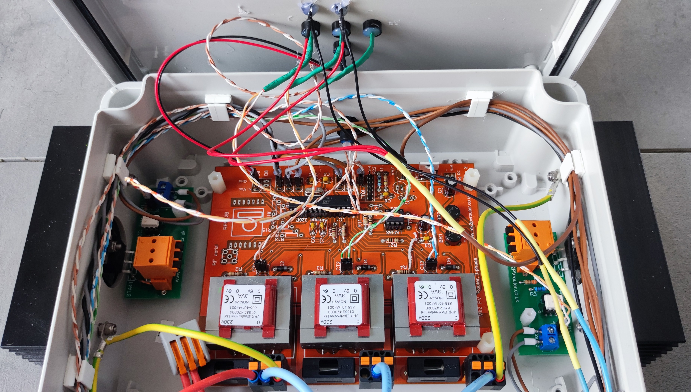

# Gallerie photo (version triphasée)

Quelques une de mes réalisations... d'autres à venir...

## Routeur triphasé 3 sorties

| | |

## Routeur triphasé 4 sorties

| | |

## Routeur triphasé, 3 sorties, dont 2 pilotables via Internet (ON/OFF et marche forcée)

| | |