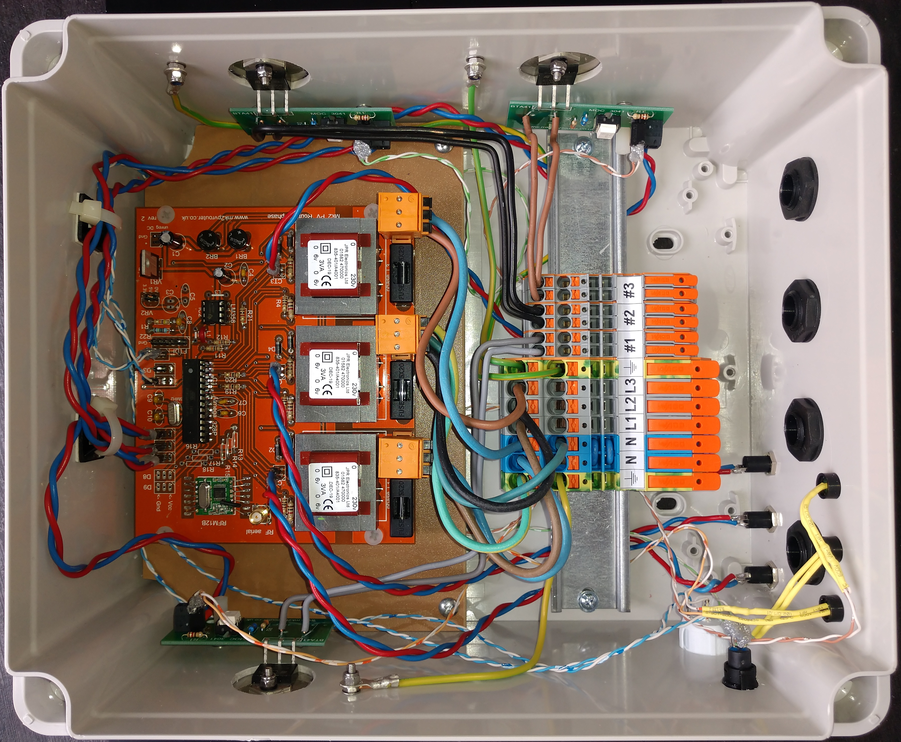
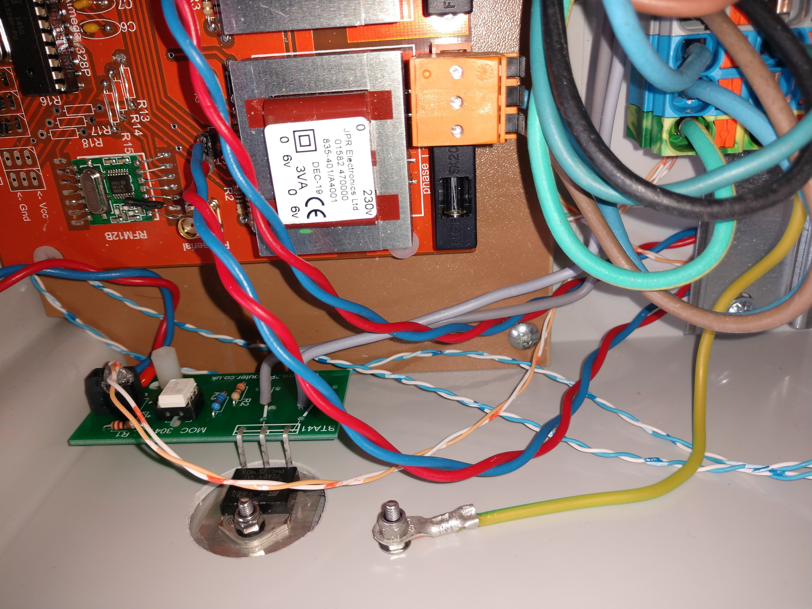
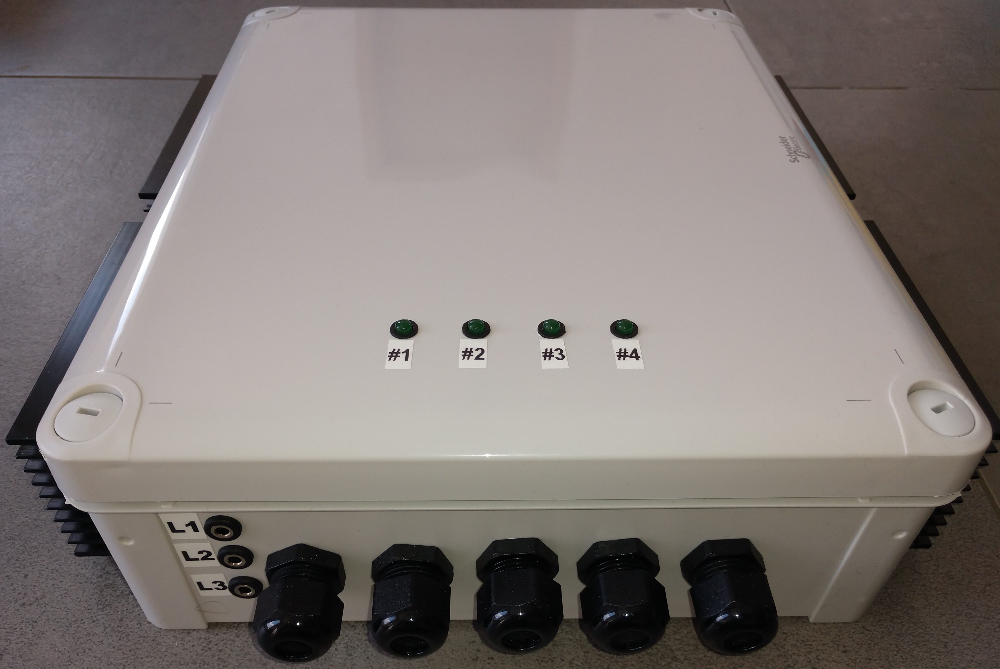
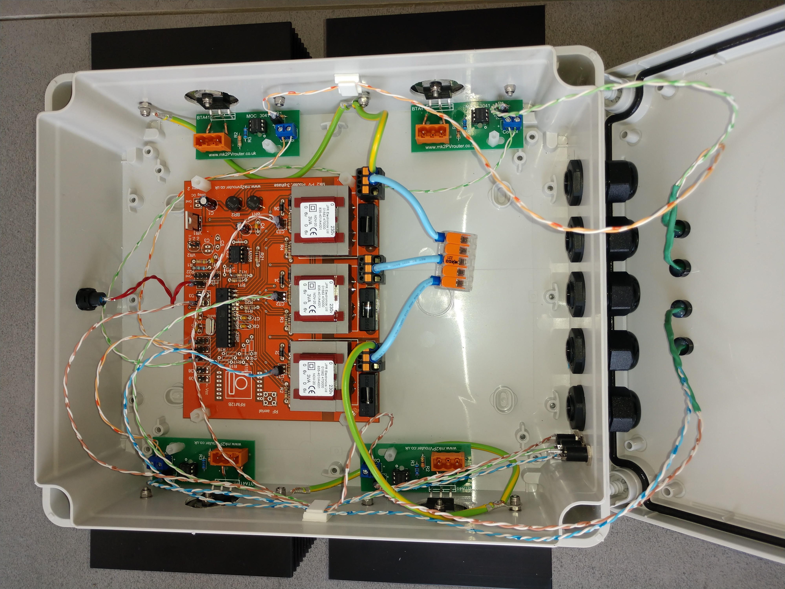
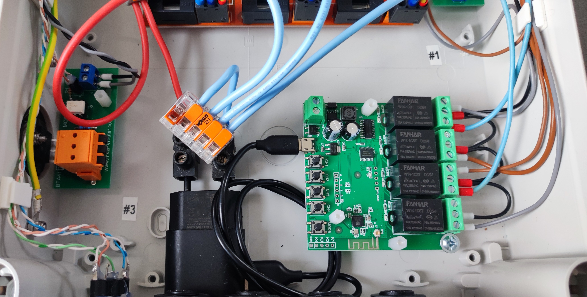
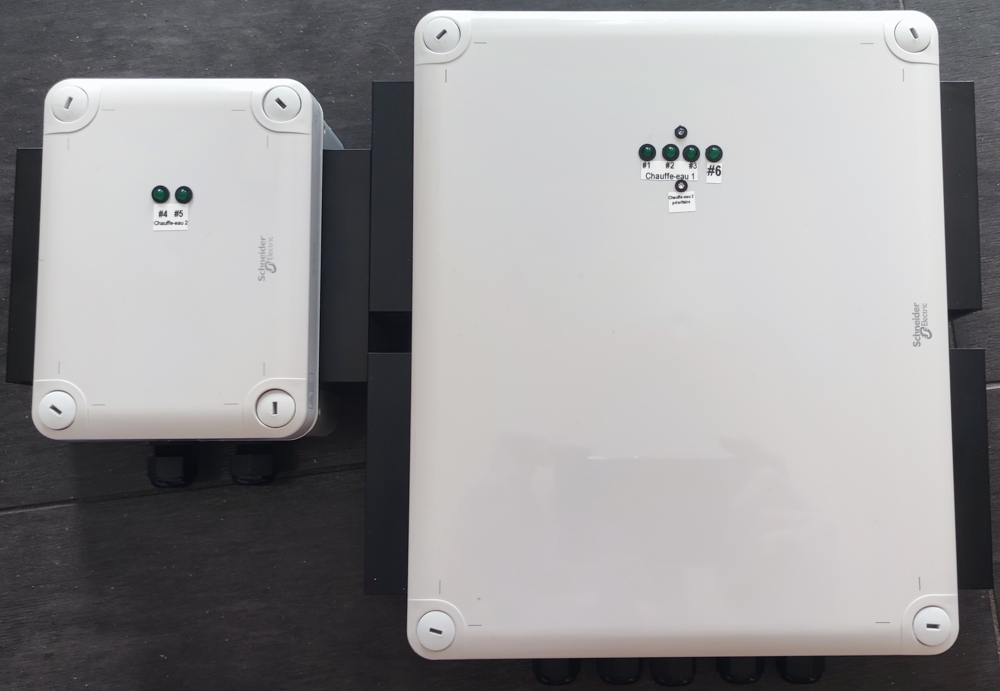

# Gallerie photo (version triphasée)

Quelques une de mes réalisations... d'autres à venir...

## Routeur triphasé 3 sorties

| | |

## Routeur triphasé 4 sorties

| | |

## Routeur triphasé, 4 sorties distantes par câble (en option 6), sorties connectées par câble réseau, boîte de répartition

| | | |
## Routeur triphasé, 3 sorties, dont 2 pilotables via Internet (ON/OFF et marche forcée)

| | |

## Routeur triphasé, 6 sorties, toutes pilotables via Internet (marche forcée et inversion de priorité)

|
